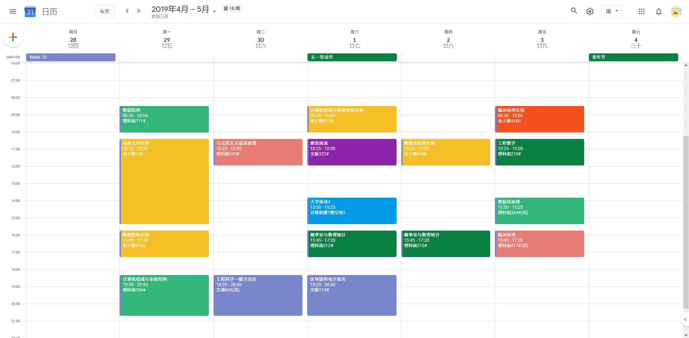

# gzhu-schedule-export

这是一个将广州大学教务系统课程表导出为iCal格式文件（.ics）的小工具。iCal文件可由Google Calendar、MS Outlook等日历程序导入。

## 使用方式

使用环境为Python3，无额外依赖。

为避免不确定因素的影响，建议先将日程导入到临时日历，确认无误后再导入到主日历。

* **导出课程表为日历日程**
  1. 下载`schedule.py`
  2. 在脚本中输入你的信息
  3. 运行脚本 `python schedule.py`
* **创建Week 1 ~ Week N的标记**
  1. 下载`week-mark.py`
  2. 在脚本中输入你的信息
  3. 运行脚本 `python week-mark.py`

## What's more

* @ZhenShaw的[广大课表项目](https://github.com/ZhenShaw/GZHU-ClassTable)
